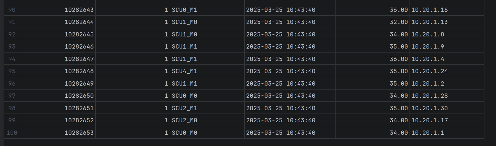

# binlog 开启与全量/增量备份

> 配套实验：MySQL 8.0.39 主库（宿主机端口 3307，binlog 前缀 `binlog`，格式 ROW）。
> 核心思路：**binlog 记录开启之后的所有增量操作，mysqldump 做全量快照，恢复时先导全量、再重放 binlog 增量**。

## 1. 开启 binlog

编辑 `/etc/my.cnf`，在 `[mysqld]` 下添加：

```ini
[mysqld]
server-id = 1
log-bin = binlog
binlog-format = ROW
sync_binlog = 1
binlog_expire_logs_seconds = 604800   # 保留 7 天，与备份周期配套
max_binlog_size = 256M
```

重启 MySQL（容器环境 `docker restart 容器名`），然后验证：

```sql
SHOW VARIABLES LIKE 'log_bin';
SHOW VARIABLES LIKE 'binlog_format';
SHOW MASTER STATUS;   -- 记住 File 和 Position，这就是"当前增量起点"
```

示例输出：

```text
+---------------+----------+------------------+-------------------+
| File          | Position | Binlog_Do_DB     | Binlog_Ignore_DB  |
+---------------+----------+------------------+-------------------+
| binlog.000020 |      157 |                  |                   |
+---------------+----------+------------------+-------------------+
```

参数说明：

| 参数 | 作用 |
| --- | --- |
| `server-id` | 主从/日志必需，取值唯一 |
| `log-bin` | 开启 binlog 并指定前缀（生成 `binlog.000001`、`binlog.000002`...） |
| `binlog-format = ROW` | 行级日志，记录每行实际变化，最安全；STATEMENT 只记 SQL 语句，MIXED 混合 |
| `sync_binlog = 1` | 每次提交同步刷盘，防断电丢日志 |
| `binlog_expire_logs_seconds` | 自动清理过期 binlog，按秒计 |
| `max_binlog_size` | 单个 binlog 文件上限，超过自动滚动到下一个 |

## 2. 全量备份（mysqldump）

```bash
mysqldump -h127.0.0.1 -P3307 -uroot -p \
  --all-databases \
  --single-transaction \
  --source-data=2 \
  --routines --triggers --events \
  > /root/backup/full_$(date +%F).sql
```

参数说明：

- `--single-transaction`：InnoDB 一致性快照，导出过程中不锁业务表
- `--source-data=2`：把备份时刻的 binlog 文件名和位置以**注释形式**写进备份文件，作为增量恢复的起点；MySQL 8.0.26 之前叫 `--master-data=2`，效果一样
- `--routines --triggers --events`：一起备份存储过程、触发器、事件
- `--all-databases`：全库备份；只备部分库用 `--databases itcast web`

从备份文件里找增量起点：

```bash
grep -n "CHANGE MASTER TO\|CHANGE REPLICATION SOURCE TO" /root/backup/full_2026-08-14.sql
```

## 3. 恢复：全量 + binlog 增量

先导全量：

```bash
mysql -uroot -p < /root/backup/full_2026-08-14.sql
```
查看表数据是否恢复：


再从备份记录的位置开始重放 binlog（备份之后的所有变化都在这些文件里）：

```bash
mysqlbinlog --start-position=157 binlog.000020 binlog.000021 | mysql -uroot -p
```

按时间点恢复到误操作之前：

```bash
mysqlbinlog --start-datetime="2026-08-14 10:00:00" \
            --stop-datetime="2026-08-14 12:30:00" \
            binlog.000020 binlog.000021 | mysql -uroot -p
```

按位置精确截断（误操作前的最后位置）：

```bash
mysqlbinlog --start-position=157 --stop-position=8934 \
            binlog.000020 binlog.000021 | mysql -uroot -p
```

查看 binlog 内容（排查用）：

```bash
mysqlbinlog -v binlog.000020
```

## 4. 清理 binlog

自动清理由 `binlog_expire_logs_seconds` 控制；手动清理：

```sql
PURGE BINARY LOGS TO 'binlog.000021';   -- 删掉 000021 之前的文件
PURGE BINARY LOGS BEFORE '2026-08-01 00:00:00';
```

注意：清理前确认从库已经拉完这些日志，否则会破坏主从同步（报 1236 找不到 binlog）。

## 5. 注意事项

1. 恢复顺序不能反：先全量、后增量，否则增量覆盖全量数据
2. `--source-data=2` 导出开始时会瞬间加全局读锁取 binlog 位置，之后不锁表
3. binlog 保留周期要和全量备份周期配套：全量一周一次，binlog 就至少保留一周
4. binlog 是二进制文件，不能用 `cat`/`vim` 直接看，用 `mysqlbinlog`
5. 主从复制依赖 binlog，改了 `log-bin` 配置重启后从库可能要从新位置重新配置

## 6. 排错

### mysqldump 报 No such file or directory

原因：输出目录不存在（如 `/root/backup`）。shell 先重定向创建输出文件，建不出来就直接报错，mysqldump 根本没执行。

解决：先建目录再执行：

```bash
mkdir -p /root/backup
```

### 1049 Unknown database

`--databases` 后面库名写错。先 `SHOW DATABASES;` 确认真实库名再备份。
